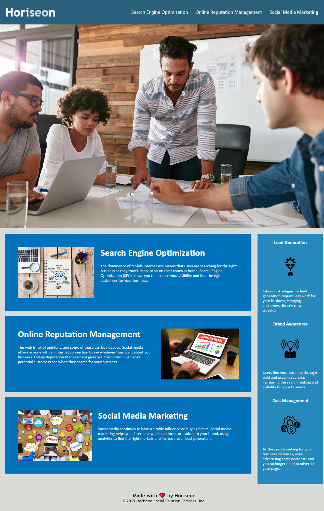

# Challenge-1

## Description

This repository serves as the source for Horiseon's website. It shall be used to add accessibility features to meet W3C Web Accessibility Initiative (WAI) standards.
Changes to the site include Search Engine Optimization through the use of semantic HTML/CSS, consolidating code, as well as adding alt text to images for the use of screen readers. Any changes made will be done by adhering to the Scout's Rule of leaving the code better than it was found.

## Submission

GitHub: https://github.com/JacksonR-K/Challenge-1

GitHub Pages: https://jacksonr-k.github.io/Challenge-1/ 

## Credits

© 2022 edX Boot Camps LLC. - For the source code of the webpage
